# Main features demonstrated with screenshots

## Login to Github creates your personal branch
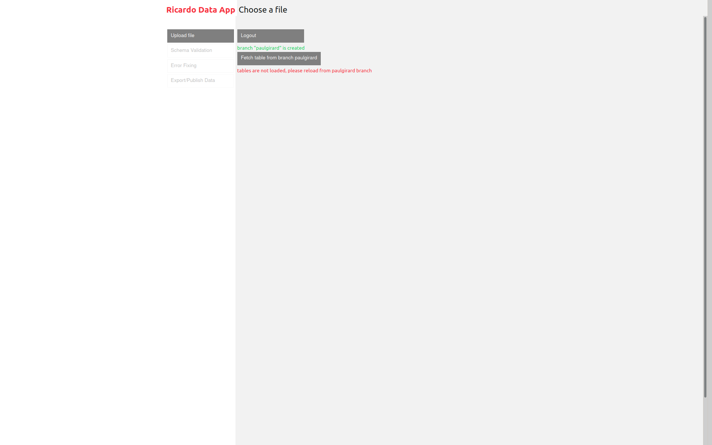
Users has to be granted access to the repository and needs to create an Personal Access Token to login.

## Upload a new trade flow table file
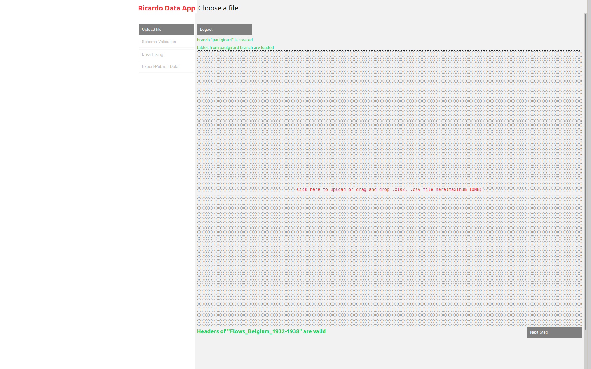
The format has to respect the [data-package specification](../datapackage.json)

## Validation process
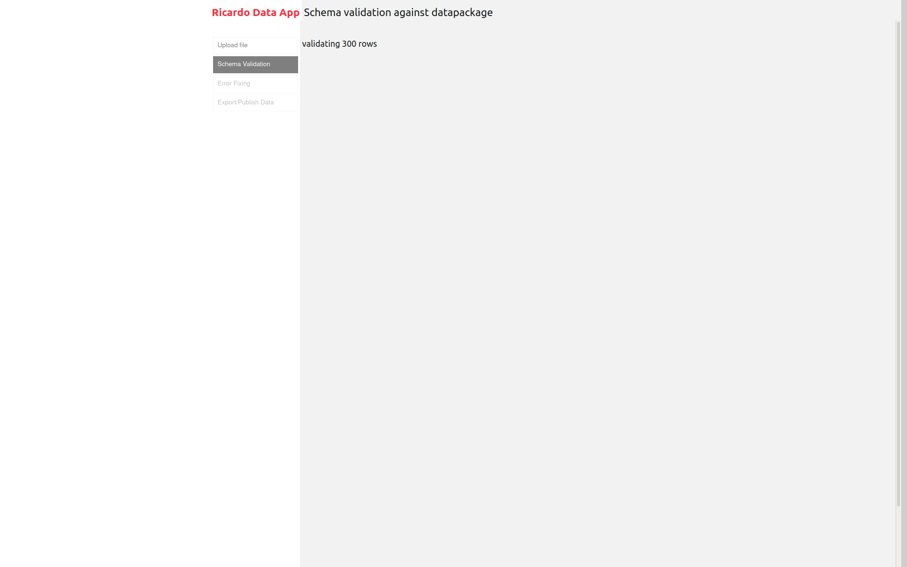
the validation process test the new data file against the data-package format. This process can take some time a minimal loader monitor the process (could easily be better...).

## Errors are group by kind
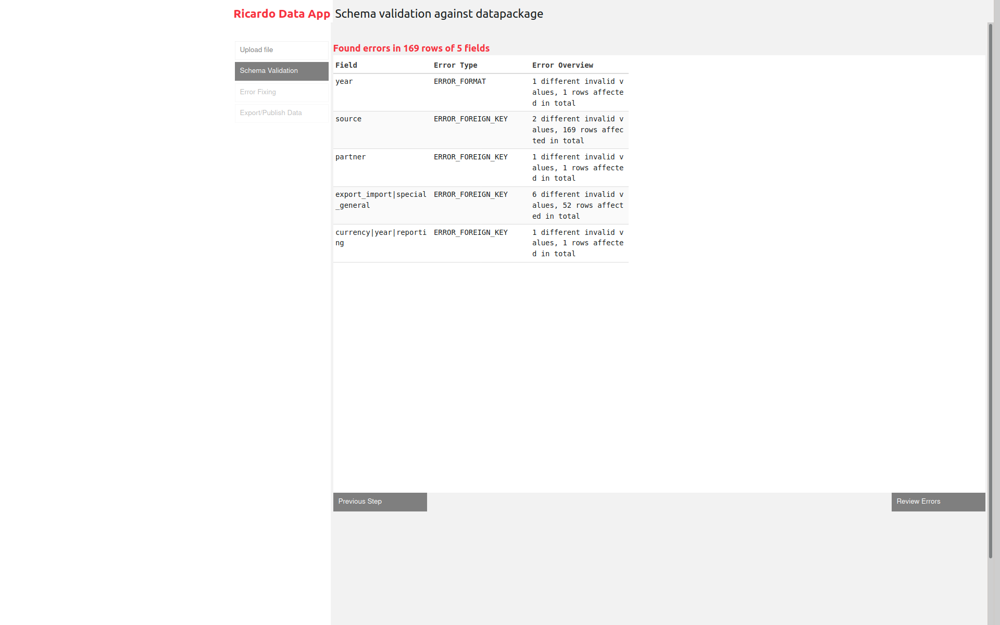

This step provide the user with a broad view of the work to be done before getting into each error details.

## Errors groups can overlap
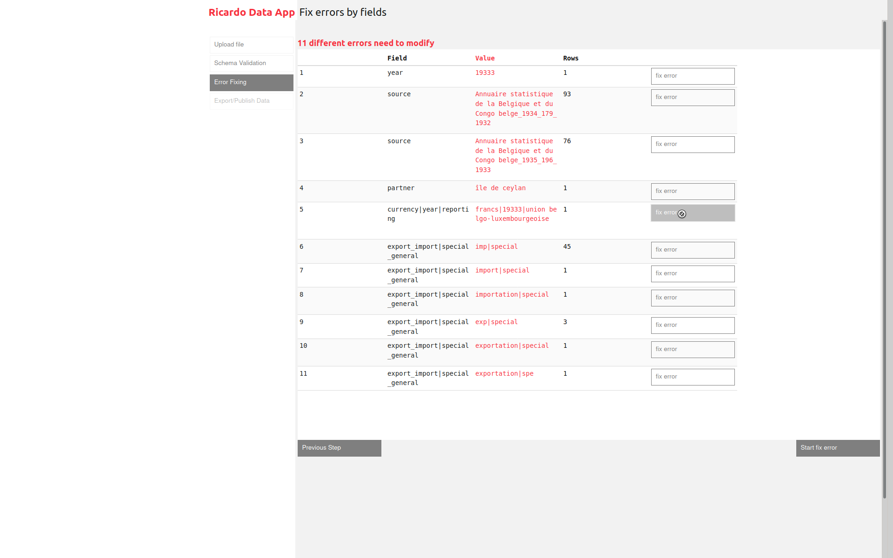

The user can't solve a dependent error group before the parent error (for instance a format error on a foreign key field) is solved.

## Web forms are built to ease validation fixing
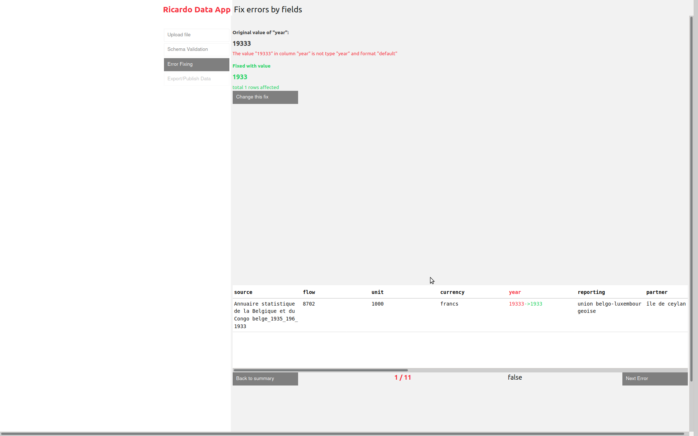
A format error on a year field has been solved. The validation diff can be seen on the bottom data row table.
## Foreign key validation can be solved
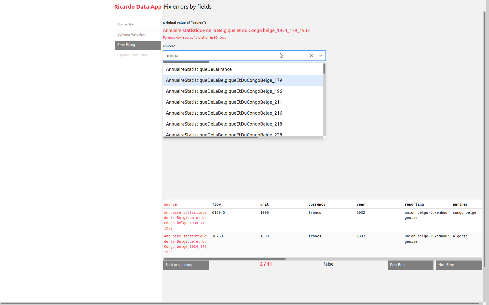
A searchable select is used to propose existing values in the related metadata table. The user can search and pick the correct value or can create a new value.

## Create a new ref in a foreign table
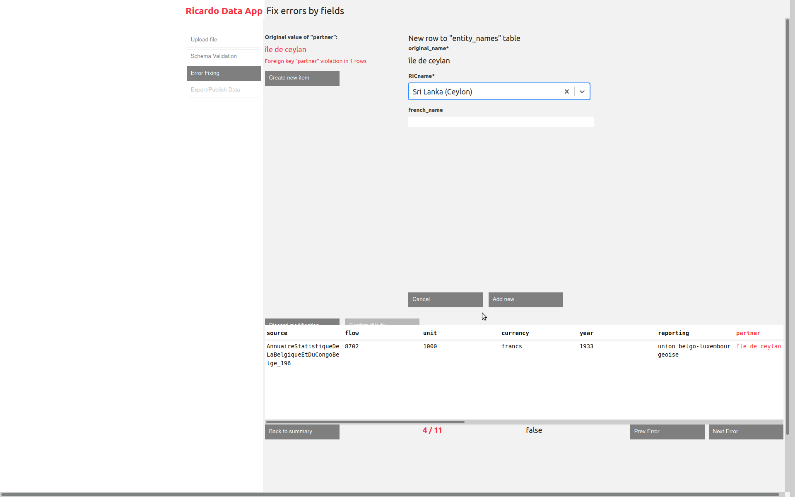

The partner name "île de ceylan" refers to the existing RICentity "SriLanka (Ceylon)".

## Dependent errors are automatically revalidate
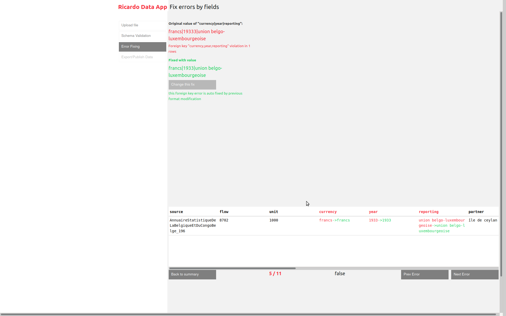
This foreign key error overlapped with the year format one. When the format error has been solved, this dependent error has been automatically validated with the new value. Thus it has been solved by the first fix. Nothing more to do by the user. 

## One simple edit can impact many rows
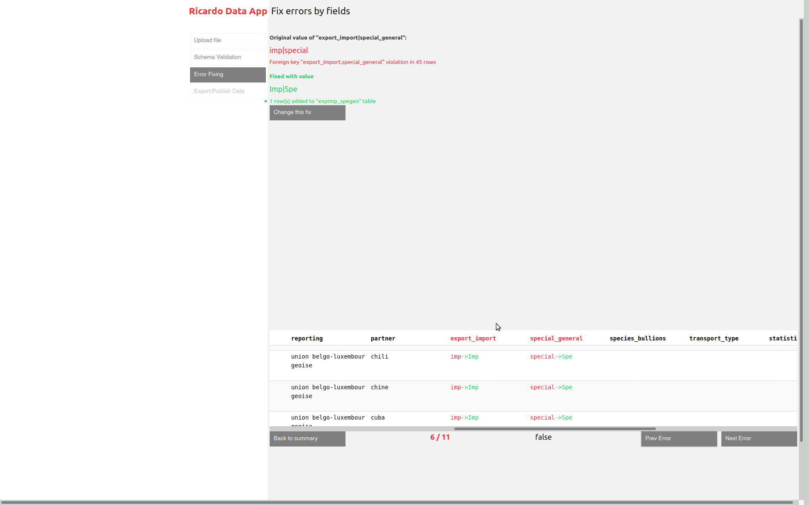
Some validation errors can be widely spread across the data table. Grouping errors allow to efficiently solve those systematic error at once. In this example, one edit fixed 45 rows.

## Edit summary
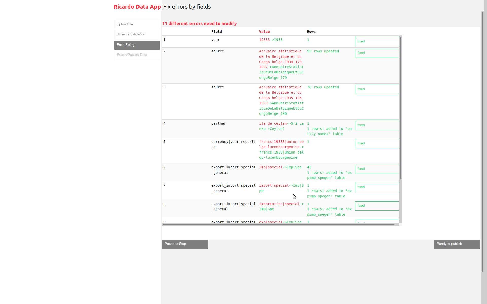
A diff table summaries the edits made.

## Download or push to github
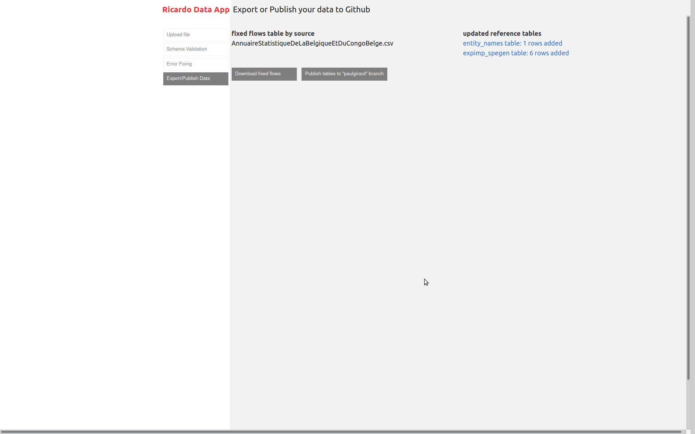
Last step, the application can push the new data file and the updates on the metadata tables to the github repository. the user can also download the edited files.